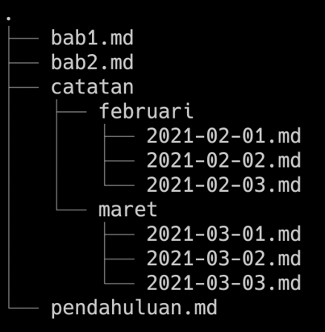
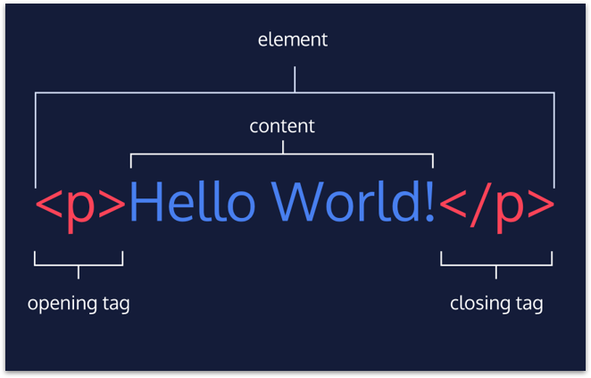
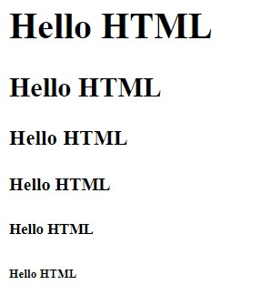
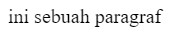
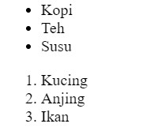

# **Writing-and-Presentation-Week1**
<h5>19 - 23 September 2022</h5>

## Unix Command Line
---

- ### Shell
    <div align="justify">Shell adalah program yang di gunakan untuk berkomunikasi atau memerintah sebuah sistam antara user dengan komputer.

    &nbsp;
- ### CLI (Command Line Interface)
    <div align="justify">CLI adalah sebuah program yang dimana user dapat mengetikkan sebuah perintah dalam bentuk teks (bisa di sebut Shell berbasis teks) yang akan memberikan instruksi kepada komputer untuk melakukan pekerjaan atau tugas yang telah di berikan.

    &nbsp;
- ### File System Structure
    <div align="justify">Sebuah filesystem yang mengatur serta menyusun bagaimana data di simpan di dalam sebuah sistem, sistem operasi Windows dan Unix-like menyusun file dan direktori menggunakan struktur yang bentuknya seperti tree atau pohon. Contoh nya seperti berikut:
    &nbsp;

    

- ### Terminal
    <div align="justify">Terminal adalah penghubung antara user dengan komputer, terminal ialah tempat user mengetikan sebuah perintah.

    &nbsp;
- ### Command
    Command untuk navigasi:
    - pwd (Print Working Directory), command untuk melihat current working directory.
    - ls (Lists), command untuk melihat isi file yang ada di sebuah direktori.
    - cd (Change Directory), command untuk berpindah direktori.

    Command untuk membuat file dan direktori:
    - touch ,command untuk membuat sebuah file.
    - mkdir ,command untuk membuat sebuah direktori.

    Command untuk melihat isi files:
    - head ,command untuk melihat beberapa line awal dari sebuah file text.
    - tail ,command untuk melihat beberapa line akhir dari sebuah file text.
    - cat ,command untuk melihat isi sebuah file.

    Command menyalin, memindahkan dan menghapus file dan directori:
    - cp ,command untuk mengcopy files atau directory.
    - mv (move), command untuk memindahkan files atau directory. Bisa digunakan untuk rename.
    - rm (remove), command untuk menghapus file atau directory.
    
    &nbsp;

## Git & Github
---

- ### Pengertian
    - Git adalah perangkat lunak untuk memanajemen kode perangkat lunak, selain untuk memanajemen git juga dapat melacak perubahan yang terjadi di suatu folder maupun file.
    - Github adalah platform penyedia layanan hosting berbasis web sebagai penyimpan hasil dari git yang di miliki oleh microsoft.

    &nbsp;

    ### Kenapa harus Git dan Github ?
    <div align="justify">Git memungkikan programmer untuk mengubah dan mengedit kode tanpa terlalu banyak kesulitan dan Github memudahkan programmer untuk dapat bekerja sama dengan tim agar dapat berkolaborasi dengan sesama programmer.

    &nbsp;

- ### Command di dalam Git dan Github
    - git config -list (untuk melihat konfigurasi direktori)
    - git init (untuk menginstall/megninisialisai git di dalam file direktori)
    - git status (untuk mengecek perubahan apa saja yang telah di lakukan)
    - git add . (untuk menambahkan file ke dalam area staging)
    - git log (untuk melihat cek point apa saja yang telah kita ubah)
    - git commit -m (untuk memberikan pesan pada cek out)
    - git branch (untuk membuat branch baru di dalam git)
    - git remote add origin (untuk menghubungkan file direktori ke github)
    - git branch -m main (berpindah dadri branch master ke branch main)
    - git push origin (untuk menguploadkan file ke dalam github)
    - git reset (untuk mereset beberapa check point)

    &nbsp;

## HTML
---

- ### Pengertian HTML
    <div align="justify">HTML (Hypertext Markup Languange) adalah bahasa markup untuk membuat sebuah kerangka website pada browser.

    &nbsp;

- ### Struktur HTML
    <div align="justify">Pada dasarnya html memiliki struktur kode seperti di bawah ini:

    ```html
    <html>
    <head>
        <title>
            Ini sebuah judul
        </title>
    </head>

    <body>
        Ini adalah sebuah body
    </body>

    </html>
    ```

    <div align="justify">Pada kode diatas ialah struktur kode dari HTML, dimana pada setiap website memiliki sebuah title atau judul dengan tag tittle. Untuk memasukkan sebuah konten yang akan di tampilkan pada website, kamu dapat menyisipkan kode pada tag body. Tag body ini yang nantinya akan selalu di gunakan pada saat membuat sebuah website. Serta ada juga Anatomi HTML, gambarnya sebagai berikut:

    &nbsp;
    

    &nbsp;
    
- ### Tag HTML
    <div align="justify">Tag adalah sebuah awalan dan akhiran dari sebuah elemen pada HTML. Tag dibuat dengan kurung siku (<...>) dan di dalamnya berisi nama tag dan biasanya ditambahkan atribute.

    &nbsp;
    <div align="justify"> Tag pada umunya di tulis secara berpasangan dimana ada tag pembuka dan tag penutup, biasa di sebut dengan double tag, namun ada juga tag yang tidak memiliki pasangan di sebut dengan single tag contohnya tag element img dan lain sebagainya.

    &nbsp;

    Contoh tag pada HTML:
    - Tag untuk membuat judul pada tampilan website
        ```html
        <h1>Hello HTML</h1>
        <h2>Hello HTML</h2>
        <h3>Hello HTML</h3>
        <h4>Hello HTML</h4>
        <h5>Hello HTML</h5>
        <h6>Hello HTML</h6>
        ```
        `<H1>` untuk membuat judul utama pada halaman yang di tampilkan pada website, semakin besar angkanya makan hasil yang di keluarkan akan semakin kecil, maka `<H6>` ialah judul paling kecil biasanya di gunakan untuk melabeli artikel yang kurang penting.
    
        Hasil yang ditampilkan:

        

    - Tag untuk membuat sebuah paragraf
        ```html
        <p>ini sebuah paragraf</p>
        ```
        Hasil yang ditampilkan:

        

    - Tag untuk membuat list
        ```html
        <!-- Unordered List -->
        <ul>
            <li>Kopi</li>
            <li>Teh</li>
            <li>Susu</li>
        </ul>

        <!-- Ordered List -->
        <ol>
            <li>Kucing</li>
            <li>Anjing</li>
            <li>Ikan</li>
        </ol>
        ```
        Hasil yang ditampilkan:

        
    
    - Tag untuk menyisipkan sebuah gambar
        ```html
        
        ```
        Hasil yang ditampilkan:

        

        <div align="justify"> Pada kode diatas ada yang berbeda dari kode sebelumnya dimana terdapat sebuah atribute alt, width dan height. 
        
        <div align="justify"> Atribute tersebut memiliki fungsi nya tersendiri, alt atau alternatif yang dimana akan menampilkan sebuah informasi jika gambar tersebut tidak dapat di tampilkan. Sedangkan Width dan Height berfungsi untuk mengatur lebar dan tinggi dari sebuah konten/gambar.

    - Tag untuk menampilkan sebuah video
        ```html
        <video width="320" height="240">
            <source src="https://bit.ly/2FKluzq" />
        </video>
        ```

        hasil yang ditampilkan:

        
    
    - Deploy HMTL
        Deploy adalah sebuah proses yang bertujuan untuk sharing program serta aplikasi yang sudah kita kerjakan supaya dapat di gunakan oleh orang lain. Apabila kita membuat suatu Web Apps atau HTML kita perlu men-Deploy ke server, untuk melakukan hal ini kita bisa menggunakan layanan yang bernama Netify.

&nbsp;

## CSS
---

- ### Pengertian CSS
    <div align="justify"> CSS adalah singkatan dari Cascading Style Sheets, yaitu bahasa komputer yang di gunakan untuk menentukan tampilan dan format halaman website.

    <div align="justify"> Jika HTML adalah sebuah kerangka dari website maka CSS adalah warna dan penampilan dari website.

&nbsp;
- ### Struktur CSS
    ```css
    .elementHTML{
        property : value
    }
    ```
    - ### elementHTML 
        berupa elemen yang berada pada file HTML.
    - ### property 
        adalah bagian yang akan di ubah, contoh jika ingin mengubah warna font maka properti dengan isi color.
    - ### value 
        adalah nilai yang user inginkan jika properti color maka nilai yang dapat di masukkan berupa warna atau kode warna.

    &nbsp;
    
- ### Cara penggunaan CSS
    - ### Inline Style
        Pada Inline Style kita menggunakan CSS langsung pada atribute HTML.
        ```css
        <h1 style="color: red;">Hello HTML dan CSS</h1>
        ```

    - ### Internal Style
        Pada Internal Style kita membuat sebuah tag `<style>` pada tag `<head>` untuk menyisipkan kode CSS.
        ```html
        <!DOCTYPE html>
        <html>

        <head>
            <title>Ini sebuah judul</title>
            <style>
                body {
                    background-color: black;
                }

                h1,
                p {
                    color: white;
                }
            </style>
        </head>
        <body>
            <h1>Hello ini adalah website</h1>
            <p>Ini adalah sebuah paragraf</p>
        </body>
        </html>
        ```
    - ### Eksternal Style
        Pada Eksternal Style kita membuat sebuah CSS pada file yang terpisah dengan format .css dan menyambungkannya dengan file HTML dengan tag `<link>`.
        ```html
        <!-- File HTML -->
        <!DOCTYPE html>
        <html>
        <head>
            <title>Ini sebuah judul</title>
            <link rel="stylesheet" href="style.css">
        </head>
        <body>
            <h1>Hello ini adalah website</h1>
            <p>Ini adalah sebuah paragraf</p>
        </body>
        </html>
        ```

        ```css
        /* file CSS */

        * {
            background-color: cyan;
        }

        h1,
        p {
            color: blue;
            font-style: italic;
        }
        ```

        &nbsp;

## Algoritma dan Struktur Data
---

- ### Pengertian Algoritma 
    <div align="justify"> Algoritma adalah suatu urutan dari beberapa langkah logis dan sistematis yang digunakan dalam memecahkan permasalahan tertentu.

    &nbsp;
- ### Seberapa penting Algoritma itu ?
    <div align="justify"> Dalam belajar programming sangat berdampingan dengan memecahkan suatu permasalahan, maka dari itu algoritma merupakan pemeran utama. Belajar algoritma sama saja dengan kita mengingat dan menstruktur alur berfikir kita secara terarah.

    &nbsp;
- ### Jenis Proses Algoritma
    - ### Sequence : instruksi yang di jalankan secara berurutan, contoh gelas diisi dengan air lalu air siap untuk di minum.
    - ### Selection : Instruksi yang di jalankan jika memenuhi suatu kondisi tertentu, contoh jika lampu merah, saya akan berhenti.
    - ### Iteration : Instruksi yang berulang kali dijalankan selama memenuhi suatu kondisi, contoh selama belum sampai rumah, saya akan terus menyetir.
    - ### Concurrent : Instruksi yang di jalankan secara bersamaan, contoh ibu mencuci baju sambil membersihkan rumah.

    &nbsp;
- ### Pseudocode
    <div align="justify"> Penulisan algoritma yang hampir menyerupai penulisan pada kode pemrograman di sebut dengan pseudocode atau metode awal yang memudahkan programmer dalam menuliskan script kode program sehingga dapat meminimalisir kendaat saat berlangsungnya perngkodean.

    &nbsp;
    - ### Pada umumnya Pseudocode memiliki 3 bagian:
        - Judul : Penjelasan dari algoritma yang di buat oleh programmer.
        - Deklarasi : Mendefinisikan semua nama atau menyiapkan variabel-variabel yang akan di gunakan.
        - Deskripsi : Step-step yang di gunakan untuk menyelesaikan permasalahan.

    &nbsp;
    - ### Tidak ada aturan baku dalam penulisan Pseudocode, asalkan mencakup:
        - Jelas,
        - Simple,
        - konsisten,
        - Dan mudah di baca orang lain.

    &nbsp;
    - ### Contoh Pseudocode
        - Deskriptif
            1. Terdapat lampu 
            2. Apakah lampu berwarna hijau ?
            3. Jika benar, maka lalu lintas jalan, lalu ke no 9
            4. Apakah lampu berwarna kuning ?
            5. Jika benar, maka lalu lintas hari - hati, lalu ke no 9
            6. Apakah lampu berwarna merah ?
            7. Jika benar, maka lalu lintas berhenti, lalu ke no 9
            8. Jika tidak ada yang benar, maka lampu rusak, lalu ke no 9
            9. Selesai

        &nbsp;
        - Penerapan Pseudocode
        ```md
        Lampu lalu lintas
        deklarasi
            lampu + text (hijau/kuning/merah)
        deskripsi
            if lampu is hijau
                cetak "jalan"
            else if lampu is merah
                cetak "berhenti"
            else if lampu is kuning
                cetak "hati-hati"
            else
                cetak "lampu rusak"
            end
        ```
&nbsp;
## JavaScript
---

- ### Pengertian JavaScript
    <div align="justify">JavaScript adalah bahasa pemrograman/scripting untuk membuat konten dinamis di halaman atau aplikasi website, game, serta membangun web serves.

    &nbsp;
- ### Fungsi JavaScript
    <div align="justify">Bahasa Pemrograman JavaScript berfungsi untuk pengembangan aplikasi website dan mobile, membangun web server dan aplikasi server, membuat website yang interaktif serta selain membuat web JS juga dapet membuat game.

    &nbsp;
- ### Tipe Data
    <div align="justify">Tipe data yaitu klasifikasi yang di berikan untuk menampung berbagai macam data yang di gunakan dalam programming. Pada JavaScript ada beberapa jenis tipe data yaitu:

    - ### Number
        Number merupakan tipe data yang merujuk pada sebuah angka baik itu bilangan berbentuk bulat ataupun desimal, Number juga bisa di sebut dengan integer.
    - ### String
        String merupakan tipe data yang merujuk pada sebuah kata atau kalimat, ciri khas tipe data string ini yaitu adanya tanda petik dua/satu ("..." atau '...').
    - ### Boolean
        Boolean merupakan tipe data yang mempresentasikan ebtitas logika. Pada tipe data boolean ini hanya memiliki 2 nilai yaitu True dan False.
    - ### NULL
        NULL ialah tipe data yang tidak memiliki nilai, maka apabila suatu variabel tidak memiliki nilai maka variabel tersebut bernilai NULL.
    - ### Undefined
        Undefined yaitu tipe data yang tidak memiliki nilai namun berbeda dengan null, undefined tidak memiliki object. Perbedaan antara null dan undefined ialah jika null tidak bernilai dengan kondisi yang sudah di rencanakan namun jika undefined tidak memiliki nilai dikarenakan sebuah kesalahan atau eror.

    &nbsp;
- ### Variabel
    <div align="justify">Variabel merupakan sebuah tempat dimana yang bertujuan untuk menampung sebuah nilai dengan identitas.

    ```
    Ada 3 cara penggunaan variabel dalam JS:
        - var (versi lama)
        - let (versi terbaru)
        - const (variabel yang nilai nya tidak dapat di ubah)
    ```

    &nbsp;
- ### JavaScript Conditional
    <div align="justify">Conditional merupakan statement percabangan yang menggambarkan suatu kondisi. Conditional statement akan mengecek kondisi spesifik dan menjalankan perintah berdasarkan kondisi tersebut.
    
    Case ini meliputi:
    &nbsp;
    - IF Statement
    - IF ELSE Statement
    - IF ELSE IF Statement
    - Truthly and Falsy
    - Swicth Case Condtional

    Contoh:
    ```js
    // saya ambil contoh case IF ELSE IF
    let lampuLalu = 'merah';

    if (lampuLalu === 'merah'){
        console.log('Berhenti!')
    }else if (lampuLalu === 'kuning'){
        console.log('Hati-hati')
    }else if (lampuLalu === 'hijau'){
        console.log('Jalan')
    }else{
        console.log('Lampu Lalu Lintas rusak')
    }
    // output Berhenti
    ```

    &nbsp;
- ### Switch Case Conditional
    <div align="justify">Penggunaan Switch Case jika kondisi dan percabangan terlalu banyak. Switch Case Conditonal

    Contoh:
    ```js
    var buttonPushed = 1;

    switch (buttonPushed){
        case 1:{
            console.log('Matikan TV!'); break
        }
        case 2:{
            console.log('Turunkan volume TV!'); break
        }
        case 3:{
            console.log('Tingkatkan volume TV!'); break
        }
        case 4:{
            console.log('Matikan suara TV!'); break
        }
        default:{
            console.log('Tidak terjadi apa-apa');
        }
    }
    ```

- ### JavaScript Looping
    <div align="justify">Looping adalah statement yang mengulang sebuah instruksi hingga kondisi terpenuhi atau jika kondisi stop/berhenti tercapai.

    Looping meliputi:
    &nbsp;
    - FOR LOOP
    - WHILE LOOP
    - DO WHILE
    - Nested LOOP

    Contoh:
    ```js
    // saya ambil contoh Looping While
    let angka = 1;

    while (angka <= 10>){
        console.log(angka);
        angka++;
    }
    ```
    