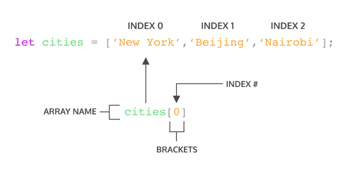

# **Writing-and-Presentation-Week3**
<h5>3 - 7 Oktober 2022</h5>

## **JavaScript Intermediate**

### **Array**
---
- <div align="justify">Array adalah tipe data list order yang dapat menyimpan tipe data apapun di dalamnya. Array dapat menyimpan tipe data String, Number, Boolean, dan lainnya.

- Contoh Array:
    ```js
    let namaBuah = ['Semangka', 'Durian', 'Nanas', 'Apel'];
    console.log(namaBuah);
    ```

- Membuat Array 
    - Array didefinisikan menggunakan square brackets
    ```js
    // square bracket
    []
    ```
- Mengakses atau Memanggil Array : Array pada javascript dihitung dari index data ke-0. Data pertama adalah index ke-0.

    

- Update Array 
    ```js
    let namaBuah = ['Semangka', 'Durian', 'Nanas', 'Apel'];

    namaBuah[0] = 'Jambu';
    console.log(namaBuah);
    // output ['Jambu', 'Durian', 'Nanas', 'Apel]
    ```

- Const in Array
    - Jika menggunakan let, kita dapat mengubah array  dengan array baru dan konten nilai yang ada di dalam array dengan nilai lain
    - Const tidak bisa melakukan update data. Namun pada Array kita dapat melakukan update konten nilai di dalam array (mutable).
    - Yang tidak bisa adalah mengubah array dengan array yang baru jika menggunakan const
- Contoh Penggunaan Const:
    ```js
    const namaBuah = ['Semangka', 'Durian', 'Nanas', 'Apel'];

    namaBuah = ['Buah Naga']
    console.log(namaBuah)
    // output : Uncaught TypeError
    ```

- Array Properties

    <div align="justify">Array memiliki 5 properti yang sering digunakan yaitu constructor, length, index, input, dan prototype.

    - .lenght : length akan mengembalikan nilai dari jumlah panjang data suatu array.
    ```js
    let namaBuah = ['Semangka', 'Durian', 'Nanas', 'Apel'];
    console.log(namaBuah.lenght)
    // output :4
    ```
    - Constructor
    - Index
    - Input
    - Prototype


- Array Method
    <div align="justify">Array memiliki method atau biasa disebut built-in methods.Kita tidak perlu membuat function lagi jika method yang kita butuhkan sudah tersedia.Sama halnya dengan Array properti. Kita bisa cek dokumentasi untuk melihat method yang sudah tersedia pada link ini built-in methods atau MDN documentation.
- Contoh : 
    - .push() adalah method untuk menambahkan item  array pada urutan yang paling akhir.
    ```js
    let namaBuah = ['Semangka', 'Durian', 'Nanas', 'Apel'];
    namaBuah.push('Jambu')
    console.log(namaBuah) // output : ['Semangka', 'Durian', 'Nanas', 'Apel', 'Jambu']
    ```
    - .pop() adalah method yang menghapus item array index terakhir.
    ```js
    let namaBuah = ['Semangka', 'Durian', 'Nanas', 'Apel'];
    namaBuah.pop()
    console.log(namaBuah); // output : ['Semangka', 'Durian', 'Nanas']
    ```
    - .shift() adalah method untuk menghapus item Array pada index pertama
    ```js
    let namaBuah = ['Semangka', 'Durian', 'Nanas', 'Apel'];
    namaBuah.shift()
    console.log(namaBuah); // output : ['Semangka', 'Nanas', 'Apel']
    ```
    - .unshift() adalah method untuk menambahkan item Array pada index pertama
    ```js
    let namaBuah = ['Semangka', 'Durian', 'Nanas', 'Apel'];
    namaBuah.unshift('Jambu')
    console.log(namaBuah); // output : ['jambu', 'Semangka', 'Durian', 'Nanas', 'Apel']
    ```
    - .sort() adalah method untuk mengurutkan secara Ascending atau Descending Alphanumeric
    ```js
    const numbers = [3,1,4,5,2];
    numbers.sort();
    console.log(numbers) // output : [1,2,3,4,5]
    ```

- Looping Array 
    - .forEach() adalah method untuk melakukan looping pada setiap elemen array.
    ```js
    let namaBuah = ['Semangka', 'Durian', 'Nanas', 'Apel'];
    
    namaBuah.forEach(element => {
        console.log(element);
    });
    ```
    - .map() melakukan perulangan/looping dengan membuat array baru.
    ```js
    let numbers = [1,2,3,4,5];

    let doubled = numbers.map(num => {
        return num * 2;
    });
    console.log(doubled);
    ```
    <div align="justify">Kita bisa lihat bahwa .map() dan forEach() sama-sama melakukan looping dan mengembalikan nilai baru dari operasi yang dilakukan
    <div align="justify">Perbedaannya adalah .forEach tidak dapat membuat Array baru dari hasil operasi yang ada dalam looping. Lalu dari segi performance juga sangat jauh. Jadi, gunakan .forEach() jika hanya memerlukan looping untuk menampilkan saja atau menyimpan ke database.

    <div align="justify">Gunakan .map() jika akan melakukan operasi pada array seperti yang dapat mengubah nilai array sebelumnya.

&nbsp;

### **Multidimensional Array**
---
> Multidimensional Array bisa dianalogikan dengan array of array (Ada array didalam array).

- Multidimensional Array yang sama seperti matriks 2 dimensi:
    ```js
    let inventory = [
        ['Kaos Polos' , 10],
        ['Jaket' , 5],
        ['Topi' , 12],
        ['Celana' , 4],
    ];
    console.log(inventory);
    ```
- Akses index multidimensional array
    ```js
    let inventory = [
        ['Kaos Polos' , 10],
        ['Jaket' , 5],
        ['Topi' , 12],
        ['Celana' , 4],
    ];
    console.log(inventory[1][0]);
    ```
- Operation using map in multidimensional array
    ```js
    let inventory = [
        ['Kaos Polos' , 10],
        ['Jaket' , 5],
        ['Topi' , 12],
        ['Celana' , 4],
    ];

    inventory.map(dataInventory => {
        let terjual = 100 - dataInventory[1];
        dataInventory[2] = terjual;
    });
    console.table(inventory);
    ```
- LOOPING FOR MULTIDIMENSIONAL ARRAY
    ```js
    let inventory = [
        ['Kaos Polos' , 10],
        ['Jaket' , 5],
        ['Topi' , 12],
        ['Celana' , 4],
    ];

    for (var i = 0, l1 = inventory.lenght; i < l1; i++){
        for (var j = 0, l2 = inventory[i].length; j < l2; j++){
            document.write('<p>' + inventory[i][j] + '</p>');
        }
    }
    ```

&nbsp;

### **Object**
---

- Object adalah sebuah tipe data pada variabel yang menyimpan properti dan fungsi (method)
- Properti adalah data lengkap dari sebuah object
- Method adalah action dari sebuah object. Apa saja yang dapat dilakukan dari suatu object.
- Membuat sebuah object:
    ```js
    let person = {
        name : 'Farhan',
        age : 21,
        isVerified: true
    }
    ```
- Mengakses Object dan Property Object
    ```js
    let person = {
        name : 'Farhan',
        age : 21,
        isVerified: true
    }
    console.log(person) // mengakses object
    console.log(person.name) // engakses properti
    ```
- Kita juga bisa menggunakan bracket notation saat memanggil properti dari sebuah object.
    ```js
    let person = {
            name : 'Farhan',
            age : 21,
            isVerified: true
        };
    console.log(person['name']);
    console.log(person['age']);
    ```
- Update object
    - Object dapat mengupdate value dari key yang sudah tersedia
    - Object dapat menambahkan key dan value baru
    ```js
    let person = {
                name : 'Farhan',
                age : 21,
                isVerified: true
            };
    
    person.age = 22;
    person.address = 'Indonesia';

    console.log(person)
    // output 
    //{
    //    name : 'Farhan',
    //    age : 212,
    //    isVerified: true
    //    address : 'Indonesia'
    //}
    ```
- Delete Object Property
    ```js
    let person = {
        name : 'Farhan',
        age : 21,
        isVerified: true
    };

    delete person.age;
    console.log(person);
    ```
- Nested Object
    ```js
    const news = {
        tittle : 'Imapct Byte menjadi Unicorn',
        desc : 'Lorem ipsum dolor sit amet, consectetur adipiscing elit.'
        author : {
            person = {
                name : 'Farhan',
                age : 21,
                isVerified: true
            };
        }
    }
    ```
- Method : Jika value yang kita masukkan pada property berupa function Maka itu disebut method.
- Pass by reference : Kita bisa mengubah data yang ada pada object melalui sebuah function dan memasukkan object sebagai parameter function. Ini biasa disebut passed by reference.
- Looping Object : Jika kita ingin menampilkan seluruh object properti. Kita bisa menggunakan looping.
- Array of Object : Kita dapat menggunakan array of object untuk data yang lebih dari satu.

&nbsp;

### **Recursive**
---

- Recursive adalah function yang memanggil dirinya sendiri sampai kondisi tertentu. Recursive kebanyakan digunakan untuk case matematika, fisika, kimia, dan yang berhubungan dengan calculation.
- A New Paradigm:
    - Procedural
    - Conditional
    - Looping
    - Modular (fuction)
    - Recursive
- Ciri dari rekursif:
    - Fungsi rekursif selalu memiliki kondisi yang menyatakan kapan fungsi tersebut berhenti. 
    - Fungsi rekursif selalu memanggil dirinya sendiri sambil mengurangi atau memecahkan data masukan setiap panggilannya.
- Contoh:
    ```js
    fuction pow(x, n){
        if (n = 1) {
            return x;
        }else {
            return x * pow(x, n - 1);
        }
    }

    console.log(pow(2, 3));
    ```

&nbsp;

### **Module**
---

- Modules memungkinkan untuk memecahkan kode menjadi file secara terpisah sehingga mempermudah dalam pengerjaan program dan dapat di gunakan berulang-ulang kali.
- JavaScript module bergantung pada impor dan ekspor
- Ada beberapa tindakan yang ada pada JavaScript Modules:
    - Export
    - Import
    - Export as
    - Import as
    - Export Default

&nbsp;

### **JavaScript OOP**
---

- OOP atau Object Oriented Programming adalah suatu paradigm pada pemrograman.
- 4 pilat OOP : 
    - Encapsulation : cara untuk membatasi akses langsung ke properti atau method dari sebuah objek
    - Inheritance : sebuah proses dimana sebuah kelas mewariskan properti dan method ke kelas lain atau childnya
    - Abtraction : eknik untuk menyembunyikan detail tertentu dari sebuah object atau method
    - Polymorphishm : kemampuan dari suatu objek untuk memiliki banyak bentuk

&nbsp;

### **Web Storage**
---

- Web Storage adalah salah satu Web API yang dapat menyimpan data secara lokal pada sisi pengguna.
- Jenis Web Storage secara umu:
    - Local Storage
    - Session Storage
    - Cookies
    - IndexDB
- Cara menyimpan data pada web storage
    ```js
    let token = "BgHajiweul"
    localStorage.setItem("token", token);
    ```
- Cata mengambil 
    ```js
    localStorage.getItem("token", token);
    console.log(localStorage.getItem("token"))
    ```
- Cata menghapus
    ```js
    localStorage.removeItem("token");
    ```

&nbsp;

### **Asynchronous JavaScript**
---

- Asynchronous ialah sebuah proses yang menyelesaikan fungsi secara paralel
- Asynchronous dibutuhkan ketika ada proses yang di tampilkan dengan waktu yang lama, maka dapat mengerjakan proses yang lain secara paralel.
- Contoh analogi Asynchronous:
    ```js
    console.log("A")

    // jadi kode di bawah akan membutuhkan waktu untuk
    // di proses
    setTimeout(() => {
        console.log("B")
    }, 1000)

    console.log("C")

    // output : 
    // A
    // C
    // B
    ```

- Kelemahan Asynchronous yaitu satu perintah akan bergantung pada output hasil eksekusi proses sebelumnya, istilah kata fungsi akan berjalan secara kejar-kejaran. Untuk mengatasi hal tersebut maka menggunakan seperti di bawah ini:
    - Callback
    ```js
    function doStep1(init, callback) {
    const result = init + 1;
    callback(result);
    }

    function doStep2(init, callback) {
    const result = init + 2;
    callback(result);
    }

    function doStep3(init, callback) {
    const result = init + 3;
    callback(result);
    }

    function doOperation() {
    doStep1(0, (result1) => {
        doStep2(result1, (result2) => {
        doStep3(result2, (result3) => {
            console.log(`result: ${result3}`);
        });
        });
    });
    }

    doOperation();
    ```
    - Promise
    - Async/await
    - Fetch